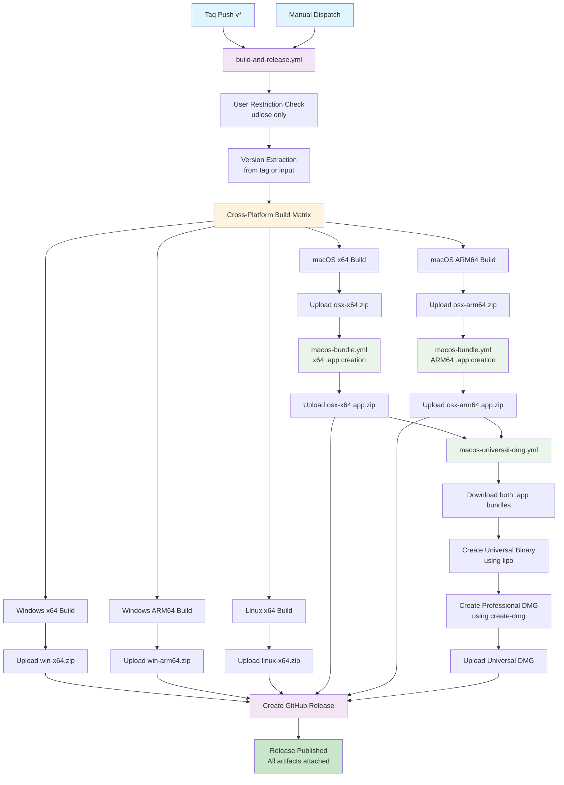
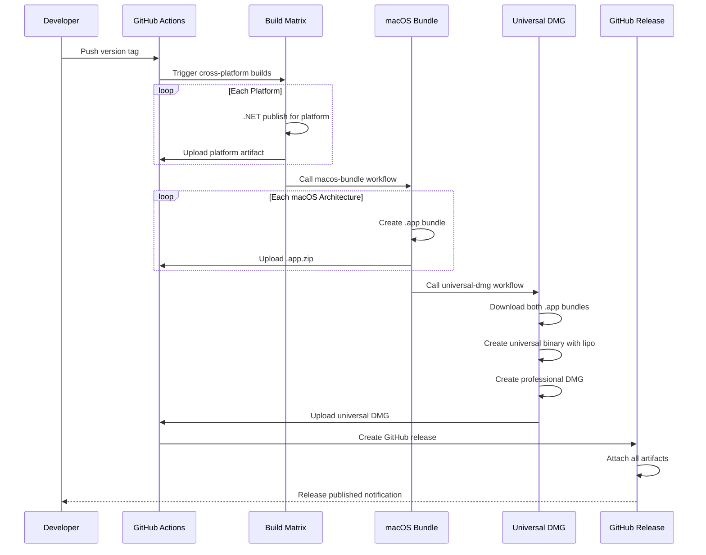

# MermaidPad GitHub Workflow Documentation

This directory contains the automated build and release workflows for MermaidPad,
handling cross-platform compilation, macOS app bundling, and multi-format distribution.

## Workflow Architecture Overview



## Workflow Details

### 1. build-and-release.yml (Main Orchestrator)

**Purpose**: Coordinates the entire build and release process for all platforms

**Triggers**:
- **Tag Push**: Automatically triggers on version tags (`v1.0.0`, `v1.2.3-beta`, etc.)
- **Manual Dispatch**: Allows manual releases with custom version input

**Jobs Sequence**:
1. **User Restriction**: Security check (only `udlose` can execute)
2. **Version Extraction**: Determines version from Git tag or manual input
3. **Cross-Platform Build**: Matrix build for 6 platform combinations
4. **macOS App Bundling**: Calls `macos-bundle.yml` for both architectures
5. **Universal DMG Creation**: Calls `macos-universal-dmg.yml` 
6. **GitHub Release**: Publishes release with all artifacts

**Build Matrix Targets**:
```yaml
- Windows x64/ARM64 → .exe files
- Linux x64 → ELF executables → .AppImage, etc.
- macOS x64/ARM64 → Mac → .app bundles and .dmg files
```

**Security Features**:
- User restriction prevents unauthorized releases
- Framework-dependent publishing (smaller downloads)
- Assembly version synchronization across all artifacts

### 2. macos-bundle.yml (App Bundle Creator)

**Purpose**: Transforms published macOS executables into proper `.app` bundles

**Workflow Call Pattern**:
```yaml
# Called by build-and-release.yml for each macOS architecture
matrix:
  include:
    - rid: osx-x64
    - rid: osx-arm64
```

**Process Flow**:
1. **Artifact Download**: Gets published macOS executable zip
2. **Bundle Structure Creation**: Creates standard macOS app directory layout
3. **Metadata Integration**: Injects `Info.plist` with version substitution
4. **Icon Integration**: Includes high-resolution app icon (`AppIcon.icns`)
5. **Permission Setting**: Ensures executable permissions are correct
6. **macOS-Optimized Zip**: Uses `ditto -c -k` to preserve Mac metadata

**Output**: Architecture-specific `.app.zip` files ready for distribution or DMG creation

### 3. macos-universal-dmg.yml (Universal Binary Creator)

**Purpose**: Combines Intel and Apple Silicon app bundles into a single universal DMG

**Dependencies**: Requires both `osx-x64.app.zip` and `osx-arm64.app.zip` from `macos-bundle.yml`

**Advanced Process**:
1. **Multi-Architecture Download**: Downloads both .app bundles
2. **Binary Verification**: Uses `lipo -info` to verify individual architectures
3. **Universal Binary Creation**: Combines binaries with `lipo -create`
4. **Professional DMG Assembly**:
   - Custom volume icon and branding
   - Drag-to-Applications shortcut
   - Optimized window layout and sizing
   - UDZO compression for smaller downloads
5. **Quality Assurance**: Mounts and verifies DMG contents before upload

**DMG Creation Parameters**:
```bash
create-dmg \
  --volname "MermaidPad" \
  --volicon "$ICON_PATH" \
  --window-pos 200 120 \
  --window-size 800 400 \
  --icon-size 100 \
  --icon "MermaidPad.app" 200 190 \
  --app-drop-link 600 185 \
  --disk-image-size 200 \
  --format UDZO
```

## Workflow Integration Benefits

### Cross-Platform Consistency
All platforms use identical source code and build configuration, ensuring feature parity across Windows, Linux, and macOS.

### Optimized Distribution Strategy
- **Windows/Linux**: Direct executable zips for simplicity
- **macOS Individual**: `.app.zip` files for developers and advanced users
- **macOS Universal**: Professional DMG for mainstream users
- **Package Managers**: Homebrew tap integration for automated updates

### Quality Assurance Pipeline


## Workflow Execution Timeline

**Typical Release Duration**: ~15-20 minutes for complete multi-platform release

**Phase Breakdown**:
- **Build Matrix** (5-8 mins): Parallel compilation for 6 platforms
- **macOS Bundling** (2-3 mins): App bundle creation and zipping  
- **Universal DMG** (3-5 mins): Binary combination and DMG assembly
- **Release Creation** (1-2 mins): GitHub release with artifact attachment

## Security and Quality Controls

### Access Control
- **Repository Protection**: Only `udlose` can trigger workflows
- **Branch Protection**: Manual workflows require specific permissions
- **Secret Management**: SMTP credentials secured in GitHub Secrets

### Verification Steps
- **Binary Architecture**: `lipo -info` confirms correct CPU targets
- **File Integrity**: SHA256 verification for all downloads
- **Bundle Validation**: Structural verification of .app bundles
- **DMG Testing**: Mount/unmount verification before release

### Error Recovery
- **Artifact Retention**: Failed builds preserve artifacts for debugging
- **Rollback Capability**: Previous releases remain available
- **Notification System**: Email alerts for workflow failures

## Development Integration

### Local Testing
```bash
# Test individual platform builds locally
dotnet publish -c Release -r osx-arm64 -o ./test-publish

# Verify cross-platform compatibility
dotnet publish -c Release -r linux-x64 -o ./test-linux
```

### Workflow Debugging
- All workflows include comprehensive logging
- Artifact retention allows post-mortem analysis
- Step-by-step output for troubleshooting build issues

### Release Management
- **Semantic Versioning**: Strict version format validation
- **Preview Releases**: Manual dispatch supports pre-release marking
- **Asset Consistency**: All platforms built from identical source
