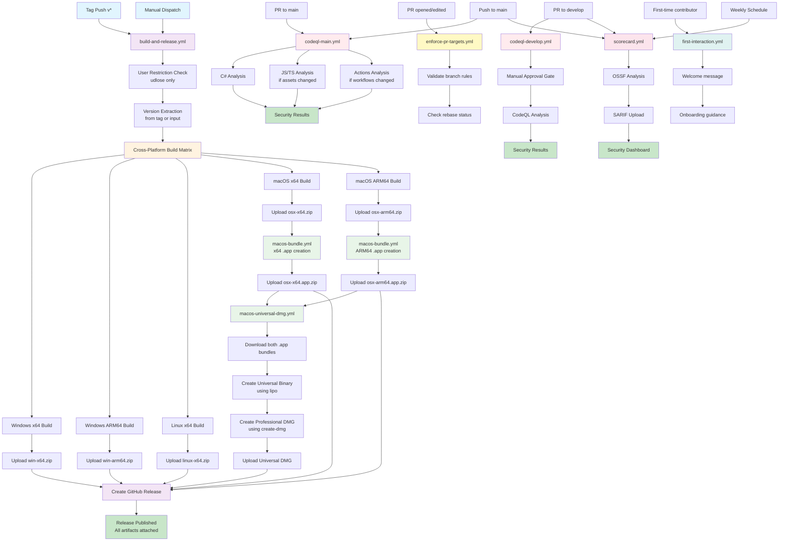
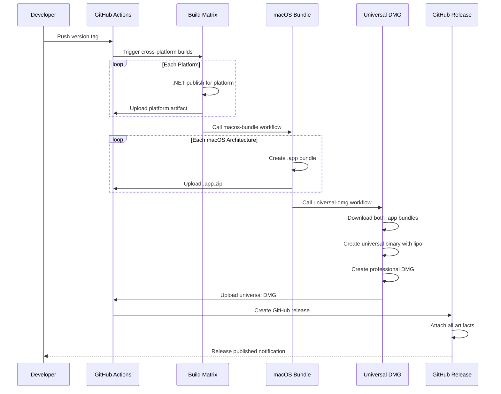

# MermaidPad GitHub Workflow Documentation

This directory contains the automated build and release workflows for MermaidPad,
handling cross-platform compilation, macOS app bundling, and multi-format distribution.

## Workflow Architecture Overview



## Workflow Details

### 1. build-and-release.yml (Main Orchestrator)

**Purpose**: Coordinates the entire build and release process for all platforms

**Triggers**:
- **Tag Push**: Automatically triggers on version tags (`v1.0.0`, `v1.2.3-beta`, etc.)
- **Manual Dispatch**: Allows manual releases with custom version input

**Jobs Sequence**:
1. **User Restriction**: Security check (only `udlose` can execute)
2. **Version Extraction**: Determines version from Git tag or manual input
3. **Cross-Platform Build**: Matrix build for 6 platform combinations
4. **macOS App Bundling**: Calls `macos-bundle.yml` for both architectures
5. **Universal DMG Creation**: Calls `macos-universal-dmg.yml` 
6. **GitHub Release**: Publishes release with all artifacts

**Build Matrix Targets**:
```yaml
- Windows x64/ARM64 → .exe files
- Linux x64 → ELF executables → .AppImage, etc.
- macOS x64/ARM64 → Mac → .app bundles and .dmg files
```

**Security Features**:
- User restriction prevents unauthorized releases
- Framework-dependent publishing (smaller downloads)
- Assembly version synchronization across all artifacts

### 2. macos-bundle.yml (App Bundle Creator)

**Purpose**: Transforms published macOS executables into proper `.app` bundles

**Workflow Call Pattern**:
```yaml
# Called by build-and-release.yml for each macOS architecture
matrix:
  include:
    - rid: osx-x64
    - rid: osx-arm64
```

**Process Flow**:
1. **Artifact Download**: Gets published macOS executable zip
2. **Bundle Structure Creation**: Creates standard macOS app directory layout
3. **Metadata Integration**: Injects `Info.plist` with version substitution
4. **Icon Integration**: Includes high-resolution app icon (`AppIcon.icns`)
5. **Permission Setting**: Ensures executable permissions are correct
6. **macOS-Optimized Zip**: Uses `ditto -c -k` to preserve Mac metadata

**Output**: Architecture-specific `.app.zip` files ready for distribution or DMG creation

### 3. macos-universal-dmg.yml (Universal Binary Creator)

**Purpose**: Combines Intel and Apple Silicon app bundles into a single universal DMG

**Dependencies**: Requires both `osx-x64.app.zip` and `osx-arm64.app.zip` from `macos-bundle.yml`

**Advanced Process**:
1. **Multi-Architecture Download**: Downloads both .app bundles
2. **Binary Verification**: Uses `lipo -info` to verify individual architectures
3. **Universal Binary Creation**: Combines binaries with `lipo -create`
4. **Professional DMG Assembly**:
   - Custom volume icon and branding
   - Drag-to-Applications shortcut
   - Optimized window layout and sizing
   - UDZO compression for smaller downloads
5. **Quality Assurance**: Mounts and verifies DMG contents before upload

**DMG Creation Parameters**:
```bash
create-dmg \
  --volname "MermaidPad" \
  --volicon "$ICON_PATH" \
  --window-pos 200 120 \
  --window-size 800 400 \
  --icon-size 100 \
  --icon "MermaidPad.app" 200 190 \
  --app-drop-link 600 185 \
  --disk-image-size 200 \
  --format UDZO
```

## Security & Quality Workflows

### 4. codeql-main.yml (Primary Security Scanning)

**Purpose**: Automated security vulnerability detection for the main branch using GitHub's CodeQL analysis

**Triggers**:
- **Push to main**: Scans committed code for security vulnerabilities
- **Pull requests to main**: Prevents vulnerable code from merging

**Multi-Language Analysis**:
```yaml
Languages Scanned:
- C# (always runs - core application code)
- JavaScript/TypeScript (conditional - only when Assets/**/*.html or Assets/**/*.*js change)
- GitHub Actions (conditional - only when .github/workflows/**/*.yml or .github/workflows/**/*.yaml change)
```

**Intelligent Path Detection**:
The workflow uses `dorny/paths-filter` to detect changed files and only runs language-specific scans when relevant:
- **C# analysis**: Always runs (core codebase)
- **JavaScript/TypeScript**: Only if HTML/JS assets modified
- **Actions**: Only if workflow YAML files modified

**Security Features**:
- **Harden-Runner**: Audits all outbound network calls to detect supply-chain attacks
- **Least-Privilege Permissions**: Each job has minimal required permissions
- **Manual Build Mode**: C# uses custom build script for precise control
- **Required Check**: Ensures at least one language analysis succeeds before allowing merges

**Process Flow**:
1. **changes** job detects which files changed
2. **codeql-csharp** runs CodeQL on C# codebase (always)
3. **codeql-javascript-typescript** runs if JS/HTML assets changed
4. **codeql-actions** runs if workflow files changed
5. **codeql-required** validates that at least one analysis succeeded

### 5. codeql-develop.yml (Development Branch Security Scanning)

**Purpose**: Pre-merge security scanning for pull requests targeting the develop branch with manual approval gate

**Triggers**:
- **Pull requests to develop**: Scans feature/bugfix branches before merge

**Key Difference from codeql-main.yml**:
- **Approval Gate**: Requires manual approval via GitHub Environment (`codeql-approval`) before running
- **Protection Against Malicious PRs**: Prevents arbitrary code execution from untrusted contributors
- **Same Analysis Pipeline**: Uses identical CodeQL configuration as main branch

**Approval Workflow**:
```yaml
PR opened → approval job waits → Maintainer reviews → Manual approval → CodeQL runs
```

**Why Approval is Required**:
- Pull requests can contain malicious workflow modifications
- CodeQL runs custom build commands that could be exploited
- Approval ensures trusted maintainer review before execution

**Concurrency Control**:
- Cancels older runs for the same PR when new commits are pushed
- Ensures only the latest commit is analyzed
- Saves CI resources and reduces analysis queue time

### 6. enforce-pr-targets.yml (Branch Policy Enforcement)

**Purpose**: Enforces Git branching strategy and prevents invalid pull request directions

**Triggers**:
- Pull request opened, reopened, synchronized, or edited

**Enforced Rules**:

**Rule 1: Only develop → main is allowed**
```yaml
Allowed:   develop → main
Blocked:   feature-x → main
Blocked:   bugfix-y → main
```
Feature and bugfix branches must merge into develop first, never directly to main.

**Rule 2: Never allow main → develop**
```yaml
Blocked:   main → develop
```
Prevents accidental reverse merges that would create circular dependencies.

**Rule 3: develop must contain main (rebase required)**
```yaml
Before opening PR (develop → main):
  git checkout develop
  git fetch origin
  git rebase origin/main
```
Ensures develop is up-to-date with main before merging, preventing integration conflicts.

**Validation Process**:
1. Checks pull request base and head branches
2. Validates branch direction against rules
3. For develop→main PRs, uses `git merge-base --is-ancestor` to verify rebase
4. Fails fast with actionable error messages if rules violated

**Error Messages**:
- Clear explanation of what's wrong
- Exact commands to fix the issue
- Links to branching strategy documentation

### 7. first-interaction.yml (Community Engagement)

**Purpose**: Welcome first-time contributors and provide helpful onboarding guidance

**Triggers**:
- **pull_request_target**: When a first-time contributor opens a PR
- **issues**: When a first-time contributor opens an issue

**Why pull_request_target?**
- Required to post comments on PRs from forks
- Runs in the context of the base repository, not the fork
- Allows writing comments even from untrusted contributors

**Issue Welcome Message Includes**:
- Gratitude for contribution
- Required information checklist:
  - Problem summary
  - Reproduction steps with sample diagram text
  - Screenshots
  - MermaidPad version, OS, CPU architecture
- Links to CONTRIBUTING.md and README.md
- Sets expectations for maintainer response time

**Pull Request Welcome Message Includes**:
- Thanks for the contribution
- PR description guidelines:
  - What changed and why
  - How it was tested (manual or automated)
  - Documentation/screenshot updates
- **Critical Testing Reminder**: Test published app, not just local dev builds
- Link to Building & Publishing section for artifact testing
- CI expectations (tests, documentation updates)

**Community Building**:
- Makes new contributors feel valued
- Reduces back-and-forth by setting clear expectations upfront
- Improves issue/PR quality through structured guidance

### 8. scorecard.yml (Supply-Chain Security)

**Purpose**: OSSF (Open Source Security Foundation) Scorecard analysis for supply-chain security posture

**Triggers**:
- **Schedule**: Weekly on Tuesdays at 15:31 UTC (for "Maintained" check freshness)
- **Push to main**: Analyzes security posture on every main branch update
- **Pull requests to develop**: Pre-merge security validation
- **branch_protection_rule**: Validates when branch protection rules change

**What Scorecard Analyzes**:
- **Branch Protection**: Are main/develop branches protected?
- **Dependency Updates**: Are dependencies kept current?
- **Code Review**: Are PRs reviewed before merging?
- **Signed Commits**: Are commits cryptographically signed?
- **Vulnerabilities**: Any known CVEs in dependencies?
- **Dangerous Workflow Patterns**: Risky GitHub Actions configurations?
- **Token Permissions**: Are workflow permissions least-privilege?
- **Maintained**: Is the project actively maintained?

**Security Integration**:
```yaml
Scorecard → SARIF format → GitHub Code Scanning Dashboard
```
- Results uploaded to GitHub Security tab
- Integrates with Dependabot and CodeQL findings
- Provides unified security view

**Public Repository Features**:
- **OpenSSF REST API**: Publishes results for easy consumption
- **Scorecard Badge**: Allows including security score badge in README
- **Transparency**: Makes security posture visible to users

**Artifact Retention**:
- SARIF results stored for 5 days
- Allows historical comparison of security posture
- Debugging failed security checks

**Conditional Publishing**:
```yaml
publish_results: ${{ github.event_name == 'push' || github.event_name == 'schedule' }}
```
Only publishes when running from main branch (push/schedule), not from PRs.

## Workflow Integration Benefits

### Cross-Platform Consistency
All platforms use identical source code and build configuration, ensuring feature parity across Windows, Linux, and macOS.

### Optimized Distribution Strategy
- **Windows/Linux**: Direct executable zips for simplicity
- **macOS Individual**: `.app.zip` files for developers and advanced users
- **macOS Universal**: Professional DMG for mainstream users
- **Package Managers**: Homebrew tap integration for automated updates

### Quality Assurance Pipeline


## Workflow Execution Timeline

**Typical Release Duration**: ~15-20 minutes for complete multi-platform release

**Phase Breakdown**:
- **Build Matrix** (5-8 mins): Parallel compilation for 6 platforms
- **macOS Bundling** (2-3 mins): App bundle creation and zipping  
- **Universal DMG** (3-5 mins): Binary combination and DMG assembly
- **Release Creation** (1-2 mins): GitHub release with artifact attachment

## Security and Quality Controls

### Access Control
- **Repository Protection**: Only `udlose` can trigger workflows
- **Branch Protection**: Manual workflows require specific permissions
- **Secret Management**: SMTP credentials secured in GitHub Secrets

### Verification Steps
- **Binary Architecture**: `lipo -info` confirms correct CPU targets
- **File Integrity**: SHA256 verification for all downloads
- **Bundle Validation**: Structural verification of .app bundles
- **DMG Testing**: Mount/unmount verification before release

### Error Recovery
- **Artifact Retention**: Failed builds preserve artifacts for debugging
- **Rollback Capability**: Previous releases remain available
- **Notification System**: Email alerts for workflow failures

## Development Integration

### Local Testing
```bash
# Test individual platform builds locally
dotnet publish -c Release -r osx-arm64 -o ./test-publish

# Verify cross-platform compatibility
dotnet publish -c Release -r linux-x64 -o ./test-linux
```

### Workflow Debugging
- All workflows include comprehensive logging
- Artifact retention allows post-mortem analysis
- Step-by-step output for troubleshooting build issues

### Release Management
- **Semantic Versioning**: Strict version format validation
- **Preview Releases**: Manual dispatch supports pre-release marking
- **Asset Consistency**: All platforms built from identical source
